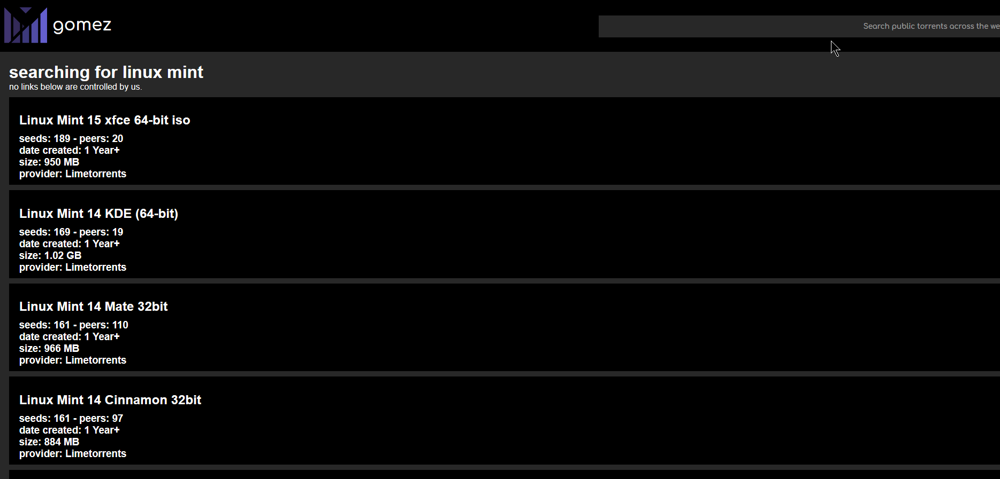
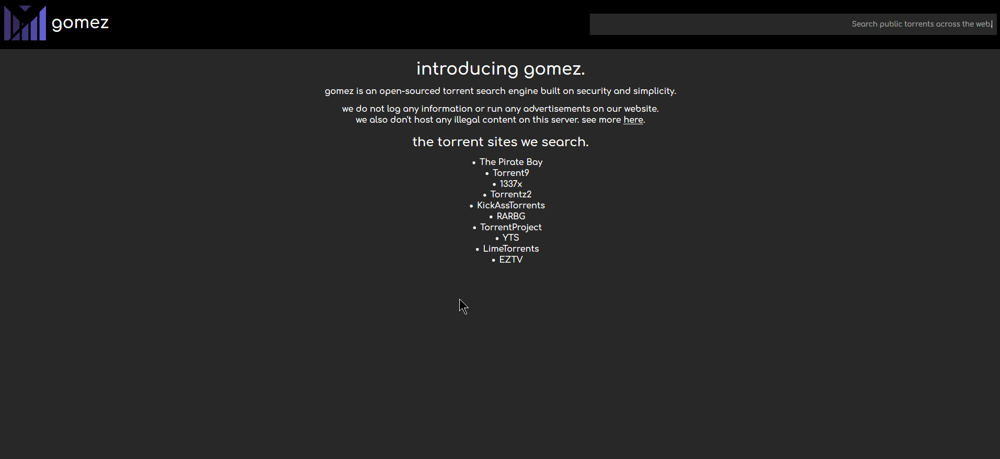

# gomez
gomez is a torrent search engine written in nodeJS.

## features
- [open json api](./docs/api/README.md)
- clean and simple ui
- no logs

## planned features
- statistics on homepage(i.e. how fast the server you're on is)
- search sort/filter
- compact mode

## screenshots




## disclaimer
use this for legal purposes only please. 

## installation (debian 10+)

```
apt update -y && apt upgrade -y
apt install nodejs npm git brotli -y 
cd ~
git clone https://github.com/normanlol/gomez
cd gomez
npm install -d
```

### 1-time Use

```
node index.js
```

### production

```
wget https://raw.githubusercontent.com/normanlol/gomez/main/gomez.service -O /etc/systemd/system/gomez.service

systemctl daemon-reload
systemctl enable --now gomez
systemctl status gomez 
```
